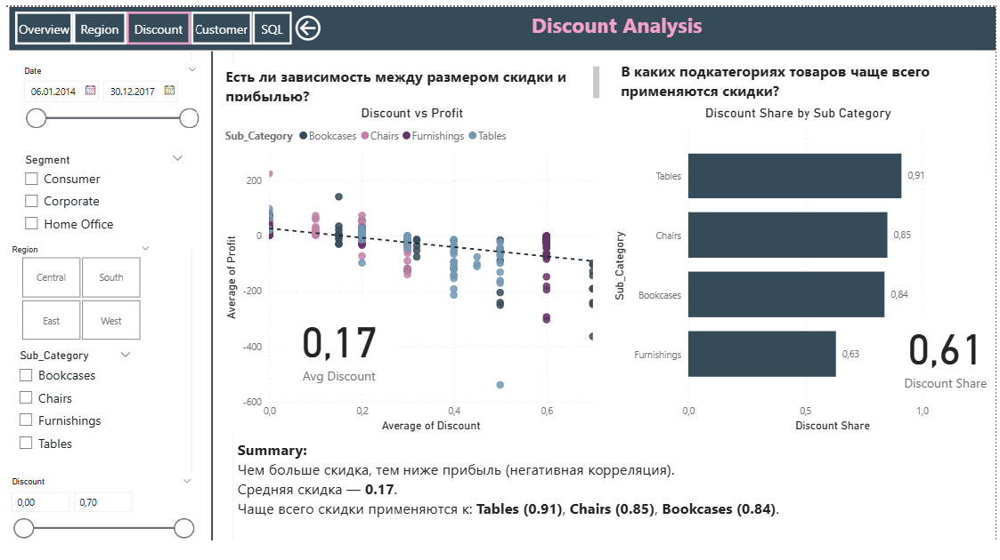

# Retail Sales Analysis and Forecasting
In this project, I worked with historical retail sales data to identify the key factors that have the greatest impact on company profit. The data covered customers, orders, products, and detailed sales records, allowing me to view the business from multiple perspectives. I explored how discounts, product quantities, and categories affect total revenue and profit, and which customer segments generate the highest income.

The project covered the full data processing cycle — from loading and normalization to SQL-based analysis, advanced analytics and visualizations in Power BI, and building forecasting models using Python.

# Data Structure
The dataset is divided into four logically related tables:

customers — customer information: ID, name, segment, region, city, postal code.

products — product details: ID, category, sub-category, name.

orders — order details: order ID, order date, ship date, ship mode, customer ID.

sales — sales details: order ID, product ID, quantity, discount, profit, sales amount.

# SQL
In the SQL section, I first checked the table for duplicates. Then, by searching for repeated ID values, I identified rows that were identical across all columns. 

If all fields matched, I considered those rows duplicates and removed them from the table.

Then I worked on the following tasks:

1. Retrieve the top 5 products with the highest total revenue.

2. Calculate the average discount in each region.

3. Identify the most loyal customers over the entire period.

4. Compare the total profit across different product categories.

5. Determine the share of sales made with a discount out of total sales volume.

6. Join all four tables into a single detailed orders table and export the result to a CSV file.

I successfully completed all these tasks, and you can check my SQL code in the repository.

Example:

# Power BI

Data Loading

Imported the four tables: customers, products, orders, and sales.

Checked and configured relationships between the tables.

When I attempted to join the tables, I encountered a many-to-many relationship caused by duplicate records. To resolve this, I created a unique key in Google BigQuery, as it was more challenging to do in Power BI.

My approach was: if an ID was repeated but had different values in other columns, I appended additional numbers to that ID, for example:

Customer_ID → Customer_ID-1

Customer_ID → Customer_ID-2

Business Questions

In the Power BI part of the project, I answered at least seven business questions using visualizations and calculated measures:

Which product categories generate the highest profit across different regions?

Is there a relationship between discount size and profit?

How does revenue change by month and year? Is there seasonality?

Which cities generate the highest revenue?

In which product sub-categories are discounts most frequently applied?

Are there products that are often sold at a loss?

How does profit differ by shipping method?

What happens to profit when filtering by region/category/segment?

What is the average order size by region or customer segment?

How many orders does one customer place on average?

Technical Requirements Implemented

In my Power BI report, I implemented the following features:

Filters by year, month, customer segment, and region.

A drill-through page with detailed information for a specific region.

A filter to display only orders with discounts.

The ability to select a product category and track its sales and profit trends over time.

Multiple report pages to logically separate different parts of the analysis (e.g., general insights, regional analysis, customer analytics, etc.).

Displayed the results of several SQL queries as separate tables or visualizations in Power BI.

Easy navigation between report pages using interactive buttons.

# Python

# Linear Regression

Overall, the results were acceptable, but I noticed outliers and that most data points were clustered in a single area. Because of this, I reworked my linear regression model: I removed the outliers, added polynomial features, and then applied a RandomForest model for regression.

# Summary
Sales show seasonality with peaks in December, while profit has declined since 2016. The most profitable shipping method is Standard Class, while Same Day is the least profitable. Top-performing cities in terms of sales are New York, Los Angeles, and Philadelphia. In the West region, Chairs bring the highest profit, while in the Central region, Tables and Furnishings generate losses. The higher the discount, the lower the profit — especially in the Tables category, where discounts reach 91%. The average customer places 2.5 orders, with the most loyal one being Seth Vernon (9 purchases). The top 5 products generated $76K in revenue, with the Riverside Palais Bookcase as the leader. To increase profit, it is recommended to reduce discounts, revise the strategy in the Central region, and focus on developing the Standard Class delivery method.

